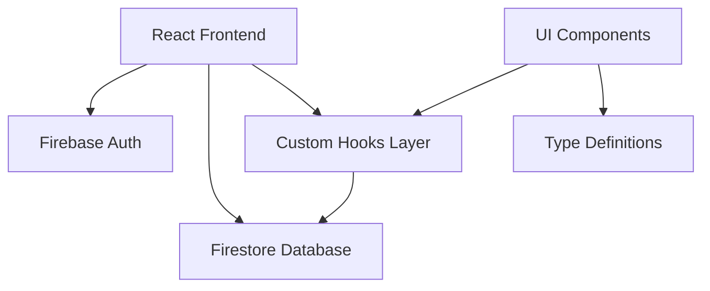

# Design Document

## Overview

The dental patient management feature will be implemented as a React-based web application using Firebase/Firestore for backend services. The architecture follows modern React patterns with TypeScript for type safety, custom hooks for state management, and component-based UI structure using Tailwind CSS.

The application will consist of a patient list page with search functionality and a modal-based patient addition form. All patient data will be stored in Firestore with real-time synchronization capabilities.

## Architecture

### High-Level Architecture



### Component Hierarchy

```
App
├── Header (Layout Component)
├── PatientListPage (Main Page)
│   ├── Search Input
│   ├── Patient Table
│   └── Add Patient Button
└── AddPatientModal (Modal Component)
    └── Patient Form
```

### Data Flow

1. **Authentication**: Firebase Auth manages user sessions
2. **Data Fetching**: Custom hooks abstract Firestore operations
3. **State Management**: React hooks manage local component state
4. **UI Updates**: Components re-render based on state changes

## Components and Interfaces

### Core Components

#### 1. Header Component (`src/components/layout/Header.tsx`)
- **Purpose**: Global navigation and user authentication status
- **Props**: None (uses Firebase Auth context)
- **Features**:
  - Display current user information
  - Logout functionality with confirmation
  - Responsive design

#### 2. PatientListPage Component (`src/pages/PatientListPage.tsx`)
- **Purpose**: Main page displaying patient list with search and add functionality
- **State Management**:
  - Search term filtering
  - Modal open/close state
- **Features**:
  - Real-time patient data display
  - Search functionality
  - Patient addition trigger

#### 3. AddPatientModal Component (`src/components/patient/AddPatientModal.tsx`)
- **Purpose**: Modal form for adding new patients
- **Props**:
  - `isOpen: boolean`
  - `onClose: () => void`
  - `onAddPatient: (data) => Promise<void>`
- **Features**:
  - Form validation
  - Loading states during submission
  - Error handling

### Custom Hooks

#### usePatients Hook (`src/hooks/usePatients.ts`)
- **Purpose**: Encapsulate all patient-related Firestore operations
- **Returns**:
  - `patients: Patient[]` - Array of patient data
  - `loading: boolean` - Loading state
  - `error: Error | null` - Error state
  - `fetchPatients: () => Promise<void>` - Refresh function
  - `addPatient: (data) => Promise<void>` - Add new patient

### Type Definitions

#### Patient Interface (`src/types/patient.ts`)
```typescript
interface Patient {
  id: string;           // Firestore document ID
  patientId: string;    // Custom patient identifier
  name: string;         // Patient full name
  nameKana: string;     // Patient name in katakana
  birthdate: string;    // YYYY-MM-DD format
  lastVisitDate: string | null; // YYYY-MM-DD or null
  createdAt: any;       // Firestore Timestamp
}
```

## Data Models

### Firestore Collection Structure

#### Patients Collection (`/patients`)
```json
{
  "patientId": "P001",
  "name": "田中太郎",
  "nameKana": "タナカタロウ",
  "birthdate": "1990-05-15",
  "lastVisitDate": null,
  "createdAt": "Firestore Timestamp"
}
```

### Data Validation Rules

1. **Patient ID**: Required, unique identifier
2. **Name**: Required, non-empty string
3. **Name Kana**: Required, katakana format
4. **Birthdate**: Required, valid date in YYYY-MM-DD format
5. **Last Visit Date**: Optional, valid date or null

### Firestore Security Rules
```javascript
rules_version = '2';
service cloud.firestore {
  match /databases/{database}/documents {
    match /patients/{document} {
      allow read, write: if request.auth != null;
    }
  }
}
```

## Error Handling

### Error Categories

1. **Authentication Errors**
   - Unauthenticated access attempts
   - Session expiration
   - Logout failures

2. **Data Fetching Errors**
   - Network connectivity issues
   - Firestore permission errors
   - Query timeout errors

3. **Data Submission Errors**
   - Validation failures
   - Duplicate patient ID conflicts
   - Network failures during save

### Error Handling Strategy

1. **User Feedback**: All errors display user-friendly messages
2. **Logging**: Console logging for debugging
3. **Graceful Degradation**: UI remains functional during errors
4. **Retry Mechanisms**: Automatic retry for transient failures

## Testing Strategy

### Unit Testing
- **Components**: Test rendering and user interactions
- **Hooks**: Test data fetching and state management
- **Utilities**: Test age calculation and validation functions

### Integration Testing
- **Firebase Integration**: Test Firestore operations
- **Authentication Flow**: Test login/logout functionality
- **Form Submission**: Test end-to-end patient addition

### Test Structure
```
src/
├── __tests__/
│   ├── components/
│   ├── hooks/
│   └── utils/
└── setupTests.ts
```

### Testing Tools
- **Jest**: Test runner and assertions
- **React Testing Library**: Component testing
- **Firebase Emulator**: Local testing environment

## Performance Considerations

### Optimization Strategies

1. **Data Fetching**
   - Implement pagination for large patient lists
   - Use Firestore query optimization
   - Cache frequently accessed data

2. **Component Rendering**
   - Memoize expensive calculations (age calculation)
   - Use React.memo for pure components
   - Implement virtual scrolling for large lists

3. **Bundle Size**
   - Tree-shake unused Firebase modules
   - Lazy load modal components
   - Optimize Tailwind CSS build

### Monitoring
- Track component render times
- Monitor Firestore read/write operations
- Measure bundle size and load times

## Security Considerations

### Authentication Security
- Firebase Auth handles secure token management
- Automatic session expiration
- Secure logout implementation

### Data Security
- Firestore security rules enforce authentication
- Client-side validation with server-side enforcement
- No sensitive data in client-side code

### Input Validation
- Sanitize all user inputs
- Validate data types and formats
- Prevent injection attacks through proper escaping